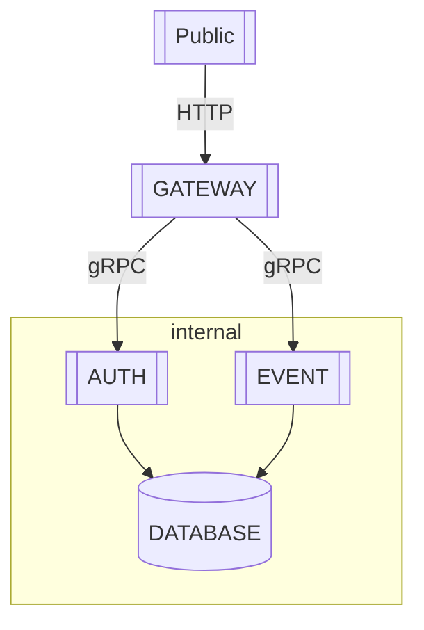

# Event Manager

> 이벤트 보상 관리 시스템

## 실행 가이드

1. Clone

```sh
git clone https://github.com/RunFridge/event-manager.git
```

2. Install Dependencies

```sh
pnpm install --frozen-lockfile
```

3. `.env` 설정

```sh
# 복사 후 필요 내용 작성
cp .env.sample .env
```

4. 개발 모드로 실행 (선택)

```sh
pnpm start:dev
```

5. Docker Compose 실행

```sh
docker compose up -d
```

6. Swagger 문서 참조 [http://localhost:3000/docs]

> [!TIP]
> 현재 편의를 위해서 register로 사용자 생성시 "admin"으로 생성되도록 설정되어있습니다.

## 시스템 구조

이벤트 보상 관리 시스템은 MSA 아키텍처로 구성되어 있습니다.

각 서비스는 독립적으로 배포 및 운영되며, gRPC를 통해 통신합니다.



## 인증 방식

- accessToken, refreshToken을 사용하여 JWT 기반 인증을 구현합니다.
- accessToken은 30분, refreshToken은 하루 동안 유효합니다.
- refreshToken은 AuthService의 inMemoryCache로 관리합니다.

## 기술 스택

- NestJS (MSA)
- MongoDB
- gRPC / Protobuf
- Swagger
- JWT / Passport / RBAC / bcrypt

## DB Schema

MongoDB를 사용하여 이벤트 및 보상 정보를 저장합니다.

> [!NOTE]
> 모델링 초안으로 코드와 약간 다름

```ts
// user.schema.ts
interface UserSchema {
  _id: ObjectId;
  username: string; // unique
  password: string;
  birthday?: Date;
  role: "admin" | "operator" | "auditor" | "user";
  active: boolean;
  createdAt: Date;
  updatedAt: Date;
  lastLoginAt?: Date;
  inventory: {
    points: number;
    coupons: string[];
    items: string[];
  };
  condition: {
    loginStreakDays: number;
    invitationCount: number;
  };
}

// user-reward.schema.ts
interface UserRewardSchema {
  _id: ObjectId;
  userId: ObjectId;
  rewardId: ObjectId;
  eventId: ObjectId;
  createdAt: Date;
  updatedAt: Date;
  claimedAt?: Date;
  canceledAt?: Date;
  status: "claimed" | "pending" | "canceled";
}

// audit.schema.ts
interface AuditSchema {
  _id: ObjectId;
  userId: ObjectId;
  action:
    | "login"
    | "register"
    | "rewardClaim"
    | "rewardCancel"
    | "eventCreate"
    | "eventUpdate"
    | "eventDelete";
  targetId: ObjectId; // userId or eventId
  targetType: "user" | "event" | "reward";
  targetName: string; // username or event title
  targetDescription?: string; // event description
  createdAt: Date;
  updatedAt: Date;
}

// reward.schema.ts
interface RewardSchema {
  _id: ObjectId;
  type: "point" | "coupon" | "item";
  title: string;
  description?: string;
  points?: number;
  couponCodes?: string[];
  items?: string[];
  createdAt: Date;
  updatedAt: Date;
  lastLoginAt?: Date;
}

// event.schema.ts
interface EventSchema {
  _id: ObjectId;
  type: "birthday" | "login" | "invite";
  title: string;
  description?: string;
  createdAt: Date;
  updatedAt: Date;
  lastLoginAt?: Date;
}
```

## 이벤트 종류

- 생일 이벤트

  - 사용자의 생일을 축하하는 이벤트

- 로그인 이벤트

  - AuthService에서 사용자가 로그인할 때마다 `loginStreakDays`를 확인하여 보상 지급 조건을 충족

- 초대 이벤트

  - AuthService에서 신규 사용자가 가입할 때마다 추천인 정보를 확인해 `invitationCount`에 따라 보상 지급 조건을 충족

## API 엔드 포인트

OpenAPI spec을 사용한 [@nestjs/swagger](https://docs.nestjs.com/openapi/introduction)를 사용하여 API 상세한 문서를 제공합니다.

상세한 문서는 실행 후 http://localhost:${PORT}/docs 에서 확인할 수 있습니다.

> Checkbox는 구현이 완료된 API입니다.

### 권한 분리

- ALL: 로그인한 모든 사용자
- ADMIN : 모든 권한을 가진 관리자
- OPERATOR : 이벤트 생성 및 수정 권한을 가진 운영자
- AUDITOR : 이벤트 조회 권한을 가진 감사자
- USER : 일반 사용자
- PUBLIC : 인증 없이 접근 가능한 API

### 일반

- [x] **[GET]** /alive : MSA 서버 상태를 확인합니다. (PUBLIC)

### 인증 관련

- [x] **[POST]** /login : 로그인 (PUBLIC)
- [x] **[POST]** /register : 회원가입 (PUBLIC)
- [x] **[POST]** /logout : 로그아웃 (ALL)
- [x] **[POST]** /refresh-token : refreshToken을 사용하여 accessToken을 재발급합니다. (ALL)

### 사용자 관련

- [x] **[GET]** /user : 사용자 정보 목록 조회 (OPERATOR)
- [x] **[GET]** /user/{id} : 사용자 정보 상세 조회 (OPERATOR)
- [x] **[PATCH]** /user/{id}/toggle-activate : 사용자 활성 상태 토글 (OPERATOR)
- [x] **[PATCH]** /user/{id}/role : 사용자 권한 변경 (ADMIN)

### 이벤트 관련

- [x] **[POST]** /event : 이벤트 생성 (OPERATOR)
- [x] **[GET]** /event : 이벤트 목록 조회 (OPERATOR)
- [x] **[GET]** /event/{id} : 이벤트 상세 조회 (OPERATOR)
- [x] **[PUT]** /event/{id} : 이벤트 수정 (OPERATOR)
- [x] **[DELETE]** /event/{id} : 이벤트 삭제 (OPERATOR)

### 보상 관련

- [x] **[POST]** /reward : 보상 생성 (OPERATOR)
- [x] **[GET]** /reward : 보상 목록 조회 (OPERATOR)
- [x] **[PUT]** /reward/{id} : 보상 목록 수정 (OPERATOR)
- [x] **[DELETE]** /reward/{id} : 보상 삭제 (OPERATOR)

### 사용자 및 보상 관련

- [x] **[GET]** /client/event : 활성 이벤트 목록 조회 (USER)
- [x] **[GET]** /client/reward : 사용자 보상 지급 목록 조회 (USER)
- [x] **[POST]** /client/event/{id}/claim : 이벤트 보상 지급 요청 (USER)

### 지급 이력 관리

- [x] **[GET]** /audit/reward : 전체 보상 이력 조회 (AUDITOR)

## 추후 개선 방향

- 보상 구체화 (쿠폰, 아이템, 포인트)
- 불필요한 쿼리 정리
- 테스트 코드 작성
- 오류 메시지 체계화
- MSA Auto Horizontal Scaling / Load Balancing

  - Roundrobin

- 현재 편의를 위해서 사용자 생성시 "admin"으로 생성되도록 설정하여, 추후 환경 변수에 따른 관리자 계정 seed 로직 추가 필요
