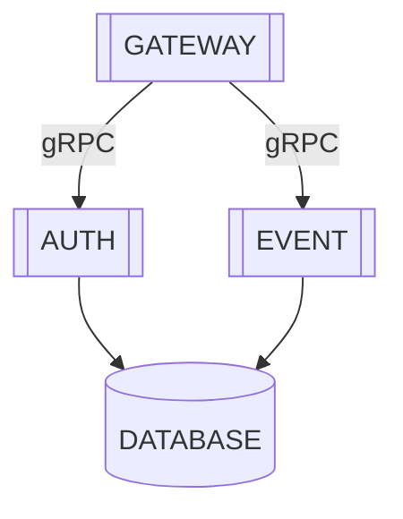

# Event Manager

> 이벤트 보상 관리 시스템

## 시스템 구조

이벤트 보상 관리 시스템은 MSA 아키텍처로 구성되어 있습니다. 각 서비스는 독립적으로 배포 및 운영되며, gRPC를 통해 통신합니다.



## 기술 스택

- NestJS
- MongoDB
- gRPC / Protobuf
- Swagger
- JWT / Passport / RBAC / bcrypt

## DB Schema

MongoDB를 사용하여 이벤트 및 보상 정보를 저장합니다.

```ts
// user.schema.ts
interface UserSchema {
    _id: ObjectId;
    username: string; // unique
    password: string;
    birthday?: Date;
    role: "admin" | "operator" | "auditor" | "user";
    active: boolean;
    createdAt: Date;
    updatedAt: Date;
    lastLoginAt?: Date;
    inventory: {
        points: number;
        coupons: string[];
        items: string[];
    };
    condition: {
        loginStreakDays: number;
        invitationCount: number;
    },
}

// user-reward.schema.ts
interface UserRewardSchema {
    _id: ObjectId;
    userId: ObjectId;
    rewardId: ObjectId;
    eventId: ObjectId;
    createdAt: Date;
    updatedAt: Date;
    claimedAt?: Date;
    canceledAt?: Date;
    status: "claimed" | "pending" | "canceled";
}

// audit.schema.ts
interface AuditSchema {
    _id: ObjectId;
    userId: ObjectId;
    action: "login" | "register" | "rewardClaim" | "rewardCancel" | "eventCreate" | "eventUpdate" | "eventDelete";
    targetId: ObjectId; // userId or eventId
    targetType: "user" | "event" | "reward";
    targetName: string; // username or event title
    targetDescription?: string; // event description
    createdAt: Date;
    updatedAt: Date;
}

// reward.schema.ts
interface RewardSchema {
    _id: ObjectId;
    type: "point" | "coupon" | "item";
    title: string;
    description?: string;
    points?: number;
    couponCodes?: string[];
    items?: string[];
    createdAt: Date;
    updatedAt: Date;
    lastLoginAt?: Date;
}

// event.schema.ts
interface EventSchema {
    _id: ObjectId;
    type: "birthday" | "login" | "invite";
    title: string;
    description?: string;
    createdAt: Date;
    updatedAt: Date;
    lastLoginAt?: Date;
}
```


## API 엔드 포인트

OpenAPI spec을 사용한 [@nestjs/swagger](https://docs.nestjs.com/openapi/introduction)를 사용하여 API 상세한 문서를 제공합니다.
상세한 문서는 실행 후 http://localhost:${PORT}/docs 에서 확인할 수 있습니다.

> Checkbox는 구현이 완료된 API입니다.

### 권한 분리

- ADMIN : 모든 권한을 가진 관리자
- OPERATOR : 이벤트 생성 및 수정 권한을 가진 운영자
- AUDITOR : 이벤트 조회 권한을 가진 감사자
- USER : 일반 사용자
- PUBLIC : 인증 없이 접근 가능한 API

### 일반

- [x] *[GET]* /alive : MSA 서버 상태를 확인합니다. (PUBLIC)

### 인증 관련

- [x] *[POST]* /login : 로그인 (PUBLIC)
- [x] *[POST]* /register : 회원가입 (PUBLIC)

### 사용자 관련

- [x] *[GET]* /user : 사용자 정보 목록 조회 (ADMIN | OPERATOR | AUDITOR)
- [x] *[GET]* /user/{id} : 사용자 정보 상세 조회 (ADMIN | OPERATOR | AUDITOR)
- [x] *[PATCH]* /user/{id}/activate : 사용자 활성화 (ADMIN | OPERATOR)
- [x] *[PATCH]* /user/{id}/role : 사용자 권한 변경 (ADMIN)

### 이벤트 관련

- [ ] *[POST]* /event : 이벤트 생성 (ADMIN | OPERATOR)
- [ ] *[GET]* /event : 이벤트 목록 조회 (ADMIN | OPERATOR | AUDITOR)
- [ ] *[GET]* /event/{id} : 이벤트 상세 조회 (ADMIN | OPERATOR | AUDITOR)
- [ ] *[PUT]* /event/{id} : 이벤트 수정 (ADMIN | OPERATOR)

### 보상 관련

- [ ] *[POST]* /event/{eventId}/reward : 보상 목록 생성 (ADMIN | OPERATOR)
- [ ] *[GET]* /event/{eventId}/reward : 보상 목록 조회 (ADMIN | OPERATOR | AUDITOR)
- [ ] *[PUT]* /event/{eventId}/reward : 보상 목록 수정 (ADMIN | OPERATOR)

### 사용자 및 보상 관련

- [ ] *[GET]* /me : 사용자 정보 조회 (USER)
- [ ] *[GET]* /me/rewards : 보상 지급 목록 조회 (USER)
- [ ] *[POST]* /me/rewards/{rewardId}/claim : 보상 지급 (USER)
